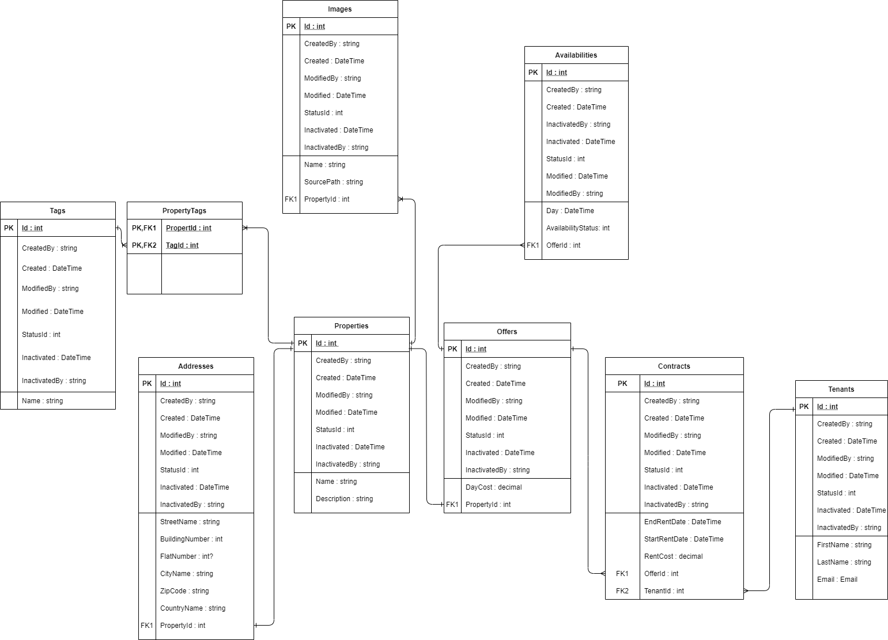

## Navigation
* [General info](#general-info)
* [Changes order](#changes-order)
* [Technologies](#technologies)
* [Database schema](#database-schema)

## General info
This Web API provides functionality for renting properties on specific dates.

## Changes order
* Fully functional API 
    * Properties added without landlord
    * Property can be added with address and its images
    * Property can be associated with existing tags
    * Renting available properties
    * Future tenant can access list of availability properties 
    * Posibility to rent property for given time
    * Tenant can access list of previous rented places

Future versions:
* Properties are added by individual landlords
    * No separation between roles. Every user has availability to be owner or / and tenant with the same account
* Create fully functional frontend with Blazor or React
	
## Technologies
Project is created with:
* .NET Core Web API
* Entity Framework

## Database schema
